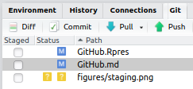
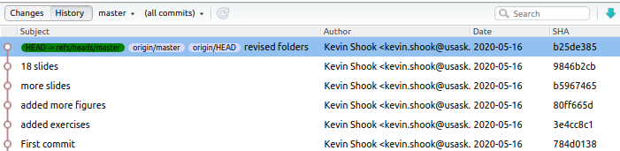

Using Git and GitHub with R
========================================================
author: Kevin Shook and Rob Chlumsky
date: June 3, 2020
autosize: true

Outline
========================================================
- Version control
- What are git and GitHub?
- How to set up
- Using git in R
- Working with GitHub

========================================================
<div align="center">


Version control programs
========================================================
- When you create R files (code, notebooks, documents), there
are always changes
- Changes sometimes damage the files
  - need to go back to older versions
- Need to add new features without damaging current version
- Especially true when working with other people
- Version control programs allow you to manage the versions
of the files that you create.

git
========================================================
- Most popular version control program
- Written by Linus Torvalds, creator of Linux
- Free Open Source Software (FOSS)
- *Distributed* version control
  - doesn't require a centralised server like SVN

GitHub
========================================================
- Website running git
- Allows you to backup your git repository
- Also allows collaboration with others
- There are other similar sites like GitLab: https://about.gitlab.com/

Getting git
========================================================
- Built into Linux
- For MacOS or Windows, you can download git from https://git-scm.com/

How git works
=======================================================
- A folder called **.git** is created in the directory holding
your your project, the working directory
- This is the repository
  - It contains all versions, current and old, of your files
- When you make changes to the files, you add them to the repository
- You can retrieve old versions of the files into the working
directory

git and Rstudio
=======================================================
- When you clone a repository from GitHub, a local repository
is automatically created
- You can also set up git for a local project in Rstudio using the menu    
Tools | Project Options ...

Working with git
=======================================================
- git is a command-based program
- There are many GUIs for git, including Rstudio
  - makes working with git much easier
  - uses Git tab in top-right  
  
  - you will still have to type commands occasionally

Typing in commands
=======================================================
- In Linux or Mac OS, you can type in git commands in any terminal, including
the terminal tab in Rstudio  
  
- In Windows, you have to use the git shell, which is accessed through a 
drop-down menu  

- git commands always begin with **git**

Configuring git
========================================================
- The first step is to tell git who you are:  

```
git config --global user.name "John Doe"
git config --global user.email johndoe@example.com
```

- You can list your current settings with the command  

```
git config --list
```

Version control
=======================================================
- As you create code, you will want to add it to the repository
  - generally each time you have made a significant change to
  any file
- Adding takes 2 steps:
1. Staging (selecting the files to add), and
2. Committing (adding the files to the repository)


Files available for staging
=========================================================
- The Git tab shows all of the files which can be staged
- 2 files have been modified (blue M icon), 
- 1 file is new (yellow ? icon) 

<div align="center">

</div>

Committing
========================================================
- Select the files to be added
  - the icons of the new files will change)
  - and click on the commit icon
  
- The commit window will pop-up, giving you a chance
to review the files before committing

Commit window
=====================================================
<div align="center">

</div>

Committing
=====================================================
- The bottom pane (Diff) shows the changes in all of the files
  - you can select or discard changes
- You **must** add a comment in the top-right panel 
before clicking on Commit

Git history
===========================================================
- In the Commit window, clicking on the History button shows the history of all
of your commits to the repository  
<div align="center">

</div>
- Each commit is identified by a unique SHA number

Branches
======================================================
- git uses *branches* to organise your code/documents
- Each repository always has a brance called **master**
  - most up-to-date, best version of the code 
- Each branch is separate, and can be changed/deleted
- The current branch is shown in the Git tab
- You can add branches at any time
- When you change the branch, the files in the working 
directory are updated

Recovering from a mistake
======================================================
- The easiest (and most desructive) way to abandon the last
commit is to use the command  

` git reset --hard <last good commit SHA>

Example:

```
git reset --hard 941b27f8
HEAD is now at 941b27f good commit before mistake
```


Working with GitHub
====================================================


Pushing and pulling
=====================================================
- It's a good idea to click on Pull to make sure that
the local repo is up to date

<div align="left">

</div>
***

<div align="center">

</div>


ssh
=======================================================
- ssh is short for "secure shell"
- provides secure, encrypted communication between 2 computers
- if you set it up on your computer, you can avoid having to
type in your user name and password every time
- part of Linux and Mac OS
- to add to Windows
https://jcutrer.com/windows/install-openssh-on-windows10


