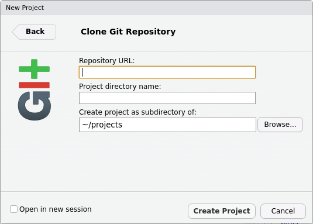
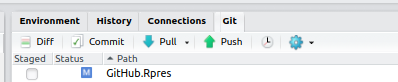
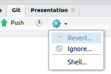
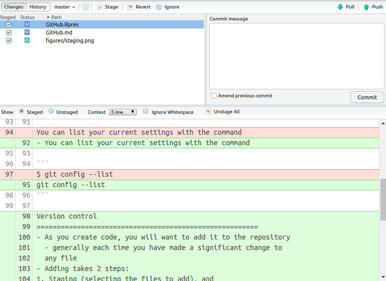
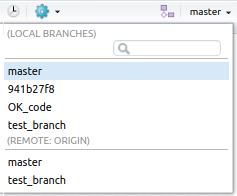
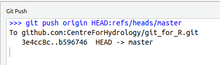
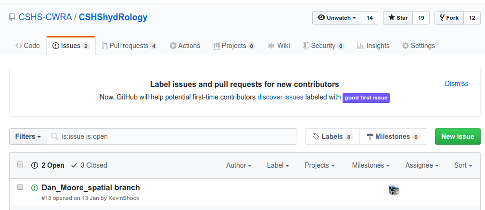

```{r setup, include=FALSE}
knitr::opts_chunk$set(echo = FALSE)
```

# Outline

- Version control
- What are git and GitHub?
- How to set up
- Using git in R
- Working with GitHub

---
```{r, echo=FALSE, fig.width=3}

```  

# Purpose of this webinar...
... is to get you comfortable *using* git and Github for your R projects, and enable you to collaborate on projects such as CSHS-hydRology.

It is *not* to make you an expert in version control software.

# Version control programs
- When you create R files (code, notebooks, documents), there
are always changes
- Changes sometimes damage the files
  - need to go back to older versions
- Need to add/test new features without damaging current version
- Especially true when working with other people
- Version control programs allow you to manage the versions
of the files that you create.

# git
- Most popular version control program
- Written by Linus Torvalds, creator of Linux
- Free Open Source Software (FOSS)
- *Distributed* version control
  - doesn't require a centralised server like SVN

# GitHub
- Website running git
- Allows you to backup your git repository
- Also allows collaboration with others
- There are other similar sites like GitLab: https://about.gitlab.com/

# Getting git
- Built into Linux
- For MacOS or Windows, you can download git from https://git-scm.com/

# How git works
- A folder called **.git** is created in the directory holding
your your project, the working directory
- This is the repository
  - It contains all versions, current and old, of your files
- When you make changes to the files, you add them to the repository
- You can retrieve old versions of the files into the working
directory

# git and Rstudio
- When you clone a repository from GitHub through GitHub, a local repository
is automatically created 

```{r, echo=FALSE, fig.height = 1, fig.width=2}
  
```
- When you manually create a project in Rstudio, you can also add a repository  


# Working with git
- git is a command-based program
- There are many GUIs for git, including Rstudio
  - makes working with git much easier
  - uses Git tab in top-right  
  
  - you will still have to type commands occasionally

# Typing in commands
- In Linux or Mac OS, you can type in git commands in any terminal, including
the terminal tab in Rstudio  
  
- In Windows, you have to use the git shell, which is accessed through a 
drop-down menu  

- git commands always begin with **git**

# Configuring git

The first step is to tell git who you are:  

```
git config --global user.name "John Doe"
git config --global user.email johndoe@example.com
```

- You can list your current settings with the command  

```
git config --list
```

# Version control
- As you create code, you will want to add it to the repository
  - generally done each time you have made a significant change to
  any file
- Adding takes 2 steps:
1. Staging (selecting the files to add), and
2. Committing (adding the files to the repository)


# Files available for staging
The Git tab shows all of the files which can be staged
- 2 files have been modified (blue M icon), 
- 1 file is new (yellow ? icon) 


# Committing  
Select the files to be added  

  - the icons of the new files will change)
  - and click on the commit icon
  
- The commit window will pop-up, giving you a chance
to review the files before committing

# Commit window


# Commit window

- The bottom pane (Diff) shows the changes in all of the files
  - you can select or discard changes
- You **must** add a comment in the top-right panel 
before clicking on Commit

# Git history

In the Commit window, clicking on the History button shows the history of all
of your commits to the repository  

  

- Each commit is identified by a unique SHA number

# Branches
- git uses *branches* to organise your code/documents
- Each repository always has a branch called **master**
  - most up-to-date, best version of the code 
- Each branch is separate, and can be changed/deleted
- The current branch is shown in the Git tab
- You can add branches at any time
- When you change the branch, the files in the working 
directory are updated

# Creating branches
You can create a new branch at any time  

  - Use the branch icon in RStudio:  
  to display the dialog box


- Current versions of all files are added to the new branch

# Changing between branches
- You can switch between branches by selecting the branch name



# Recovering from mistakes
There are *lots* of ways of screwing up your code!  

  - accidentally deleting files  
  - accidentally deleting many lines in a file (and saving)  
  - overwriting files
   
This is why it's a good idea to make a branch *before* making
big changes to your project

sethrobertson.github.io/GitFixUm shows how to recover from many different types of 
mistakes

# Working with GitHub

- The GitHub/GitLab repository linked to your local repo
is referred to as the "Remote"
  - i.e. the repo that is online is the remote one, the repo on your desktop is local

# Pulling

- Pulling downloads the GitHub repo to your local repo
- It's a good idea to click on Pull to make sure that
the local repo is up to date before doing any new work


# Pushing

- Pushing uploads your local repository to GitHub 
  - You should only push to your *own* GitHub repository



# Working with others

- The most important feature of GitHub is the way it enables people
to work together on projects
- Each project will typically have an owner, and one or more people
who can approve changes
- If you aren't one of these people (and even if you are!), you
shouldn't be pushing changes to the **master** branch directly.

Bug reports (Issues)
========================================================
- One of GitHub's most important features.
- Very easy to submit an Issue  


- Writing a *good* bug report is an art - see https://github.com/rstudio/rstudio/wiki/Writing-Good-Bug-Reports

# Forking
- A *fork* is complete copy of a GitHub repo  
  - lets you copy other work to use as a basis for your own   
  - also lets you make a working copy the repo files, without affecting
the original repo  
- A good way to create new features or fix bugs  
- When you are finished, you can then submit a Pull Request  

# Pull requests
 - Pull requests are submitted throught GitHub
   - tell members of the project about your suggested changes
   - allows discussion
 - Files can then be merged with the specified branch

# ssh
- ssh is short for "secure shell"
- provides secure, encrypted communication between 2 computers
- if you set it up on your computer, you can avoid having to
type in your user name and password every time
- part of Linux and Mac OS
- to add to Windows  
[https://docs.microsoft.com/en-us/windows-server/administration/openssh/openssh_install_firstuse](https://docs.microsoft.com/en-us/windows-server/administration/openssh/openssh_install_firstuse)  

- Once installed, you have to configure it to create a key and set up
your GitHub account to use the key  
[https://help.github.com/en/github/authenticating-to-github/connecting-to-github-with-ssh](https://help.github.com/en/github/authenticating-to-github/connecting-to-github-with-ssh)

# Typical Workflow
1. Fork a repository of interest to your own Github account (creates a copy of this repo on your own account).
2. Checkout your version of this repo locally.
3. Make updates/ changes/ new branches/ etc. on your local account. Preferably in a new branch.
4. Merge/ push changes to the remote branch on your forked repo.
5. Make a pull request to bring these changes from your repo back to the original.
6. Celebrate in having made a contribution to another project!

# Git and R Exercises
This will walk through the typical workflow above with two examples:
1. This presentation repository (CentreForHydrology/git_for_r)
2. The CSHS-hydRology package (CSHS-CWRA/CSHShydRology)

# Questions?

# Wrap-Up
- **lots** of resources online for git, github, and R support
- many cool things that can be done with R, RStudio, and Git:
  - presentations, papers, reports, webpages, animated htmls...
  - Git pages, project landing pages websites, etc.

# Wrap-Up
- please fill out our post-webinar survey (click on the url): [https://docs.google.com/forms/d/e/1FAIpQLSeUf7iG_GZoxrKHkKrh6cqVs_baFSeNpm1jaBZV0kQZJcvQ7w/viewform?usp=sf_link](https://docs.google.com/forms/d/e/1FAIpQLSeUf7iG_GZoxrKHkKrh6cqVs_baFSeNpm1jaBZV0kQZJcvQ7w/viewform?usp=sf_link)
- support the CSHS-hydRology project as you can:
  - join our newsletter signup and monthly meetings
  - contribute function ideas, review code, tell your colleagues about this group
- stay tuned for free webinars on R and hydrology in the future